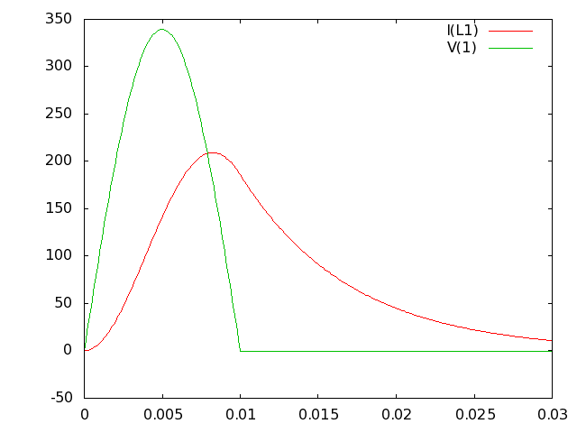

# Example 010.

Using the Generator in Transient Analysis.

At last, we are ready to look at some time domain analysis. Time domain
means as it happens in time and is also called ``transient analysis''.
The outputs should be the same as you would see looking into an oscilloscope
if you were testing a real circuit.

This is a simple circuit showing how to calculate a real result for a simple
real life problem. The problem is to magnetise some permanent magnets using an
electromagnetic coil. Ignoring the physical side of the setup and considering
only the electronics, we have an coil which consists of a resistor in
series with an inductor, this is being driven by a sinusoidal supply but the
supply is only switched on for half a cycle.

Here in Australia, the mains supply is 240V RMS AC at 50Hz. Thus, one half
cycle lasts for 10 miliseconds. The ``generator'' device provided by acs is
the ideal thing to create a pulse such as this.

	.title MAINS PULSE HITS MAGNETISING RIG
	V1 1 0 generator 1
	R1 0 2 850m
	L1 1 2 6mH
	.options vmin=-1e5 vmax=1e5
	.generator freq=50 width=10m ampl=339.4
	.print tran I(L1) V(1)
	.op
	.tran 1e-4 30e-3
	.end

This can be run in batch mode and the output will be in plottable format
in the file ``eg10.dat''. Looking at the plot, it is easy to see the peak
current of around 250 Amps (needless to say, don't try the practical experiment
at home unless you can handle such surges). Also note the shape of the current
pulse is a little bit like an exponential decay and a little bit like a sine
wave.

You might notice a number of new commands in the above example. Firstly,
the word ``generator'' appears in two places. The output end of the generator
appears in the specification of V1. When used like this, the generator function
is being invoked and the only parameter this function has is a scaling factor
(in this case 1 for simplicity). Later n the generator command is invoked on
a command line (i.e. begins with dot) and this has a bunch of parameters
(three of which are used in this example). It is important not to get confused
between the generator function and the generator command, the name is the same
but the syntax is different and they are used in different places.

As well as the generator, some options are being changed. These options are the
maximum and minimum voltages that act as limits for convergence purposes. The
default values are suitable for typical amplifier circuits but if you want to
work with higher voltages (such as power circuits) then you must explicitly
tell the simulator by adjusting these options. You can try the above circuit
with lower values for these or with the default values and see that it does
alter the output calculation. Currently, there is no warning system to tell
you something is wrong so make sure you set them comfortably higher than any
voltage you expect to encounter in the circuit.

Now there is the transient analysis itself. This analysis works by taking time
steps and you must specify how small you want these steps to be and how long
the analysis should run for. The output redirection option is the same as
for other analyses. One special point about the transient analysis is that you
must run an ``op'' analysis first in order to establish the initial conditions.
In the example it really is not very important but in other cases it can make
a significant difference to transient behaviour.

