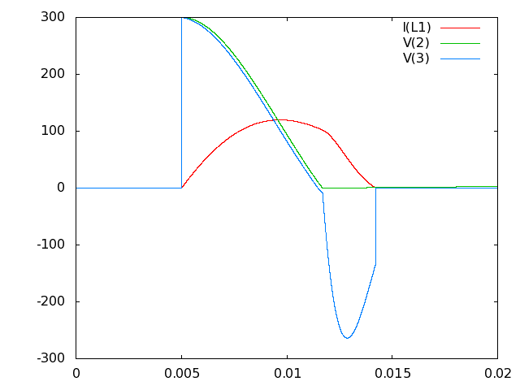
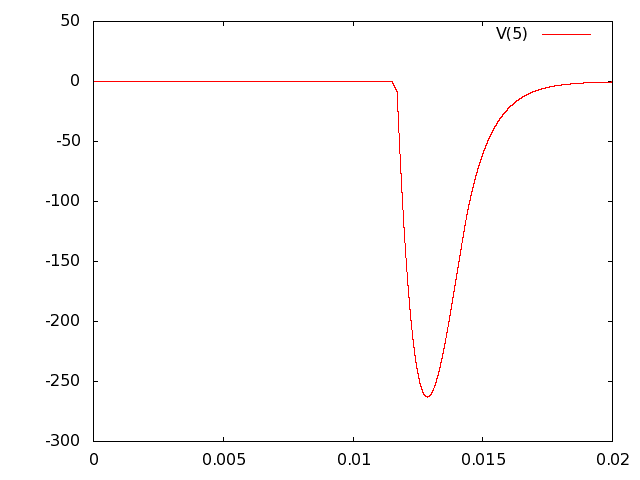

# Example 011.

	.title CAPACITOR PULSE FOR MAGNETISING RIG
	.model switch SW VT=150 VH=150 RON=0.1 ROFF=1Meg
	.model diode D
	V1 1 0 340
	R1 1 2 500
	C1 2 0 2000u IC=299.8
	S1 2 3 2 0 switch OFF
	R2 3 4 850m
	L1 4 0 6mH IC=0
	D1 5 3 diode
	R3 5 0 5
	C2 5 0 200u
	.options vmin=-1e5 vmax=1e5
	.print tran I(L1) V(2) V(3) V(5)
	.tran 0 20e-3 1e-6 >eg11.dat UIC QUIET
	.end

This example shows another approach to generating a magnetising pulse --
discharge a capacitor into the coil, depending on the capacitor as a high
current source. This also uses some new components and different techniques.
Firstly, the coil is still modeled using an inductor in series with a
resistor (in this case L1 and R2). The main energy storage capacitor (C1) is
fed from a 340V DC source through resistor R1, the value of R1 is such that
C1 slowly charges. Since the full charge cycle of C1 is boring, we just tell
the simulator that C1 is almost fully charged.

To achieve this the option, ``IC=299.8'' is used which implies that the initial
condition of C1 is to be charged up to 299.8 volts. Similarly, L1 is also given
an initial contition, ``IC=0'', which is to say that at time 0 there is no
current flowing in the inductor. Thanks to these initial condition
specifications, we don't need to run an ``.op'' operating point analysis
prior to the transient analysis. We do, however, need to specify ``UIC''
on the transient analysis command where UIC means ``Use Initial Conditions''.

The result is that the simulation shows only the last bit of the slow charge
through R1 until the capacitor reaches 300 volts and the switch activates.

There are a few more special things about this circuit. Consider the component
S1 that connects the capacitor to the coil. This component is a voltage
controlled switch. The parameters for the switch are given in the .model
command, defining a model called (rather unimaginatively) ``switch''. This
defines what the ``ON'' resistance of the switch is and what the ``OFF''
resistance is as well as the thresholds for changing state ON to OFF and
OFF to ON. Many devices such as MOSFETs, relays and optocouplers can
be approximated by a switch - admittedly it is an idealised representation,
but that may be desirable in some situations and at least acceptable in others.
Note that the switch too is given an initial condition (OFF).

Run the simulation in batch mode as follows:

	acs eg11.ckt
	gnuplot
	set data style lines
	plot 'eg11.dat', 'eg11.dat' using 1:3, 'eg11.dat' using 1:4
	replot 'eg11.dat' using 1:5
	exit

Since this run produces rather a lot of output, the ``Quiet'' option is
added to the transient analysis in order to avoid excessive scrolling.
It should be evident that the voltage in C1 slowly charges up to 300 volts
while the switch stays open and nothing much else happens. Then the switch
shuts and the C1 voltage starts to fall while the current in L1 rises and
the energy is transfered from the capacitor to the inductor. With a resistance
of 100 miliohms in the switch and another 850 miliohms in the coil, some
of the energy is lost to heat and the inductor reaches peak current (approx
120A) before the capacitor is fully discharged - ideally the switch could be
opened there but in this case the switch is programed to open when the
capacitor voltage reaches zero.

Finally the capacitor voltage does reach zero and the switch opens. This leaves
a noticable kink in the plot of the inductor current and it starts the
inductor energy transfering into C2 and R3 through D1. Finally all the energy
is dumped into R3 as heat. An interesting thing happens when the inductor
current reaches zero and D1 goes back into reverse bias -- the voltage at node
3 goes into a brief high frequency oscillation. Is the simulator playing up
here? What is going on?

Actually, this is correct behaviour as the last tiny burst of energy in
L1 has nowhere to go, it sets up an oscillation between the junction
capacitance in D1 and the inductance of L1. This is a property of using
diodes to switch a coil and does occur in real circuits too. The simulator
does not know the junction capacitance of D1 because it has not been specified
in the ``.model'' line (actually with no junction capacitance specified,
acs drops the capacitor out of the diode model completely) so the oscillation
flips back and forth with each time step and the magnitude of the swing
at node 3 is dependent on the size of the timestep used (try a longer timestep
and see that node 3 shows a larger voltage swing at this point).

In this case, the inductor current is the result of interest but if it
were necessary to know exactly how node 3 behaved at the end of the pulse
then more care would be required in determining the capacitance at work
around node 3 (in particular the diode and switch behaviour).

